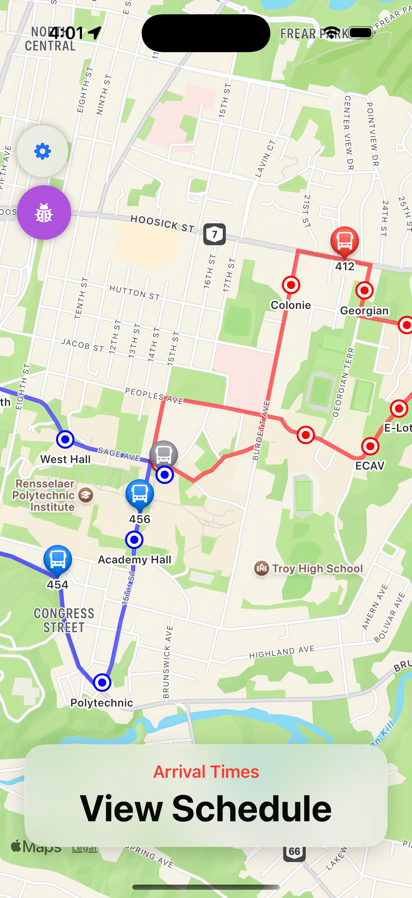
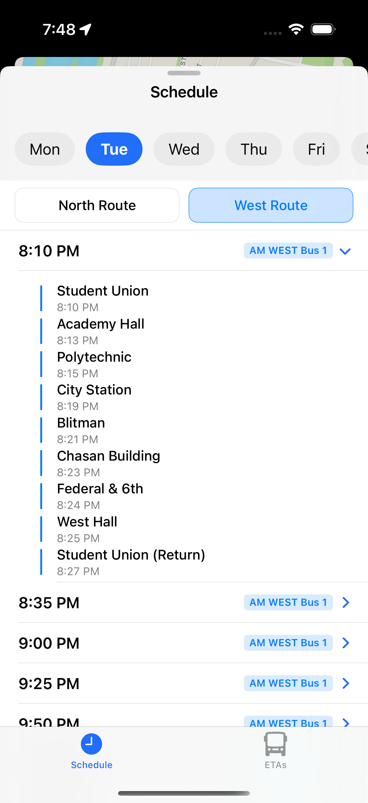
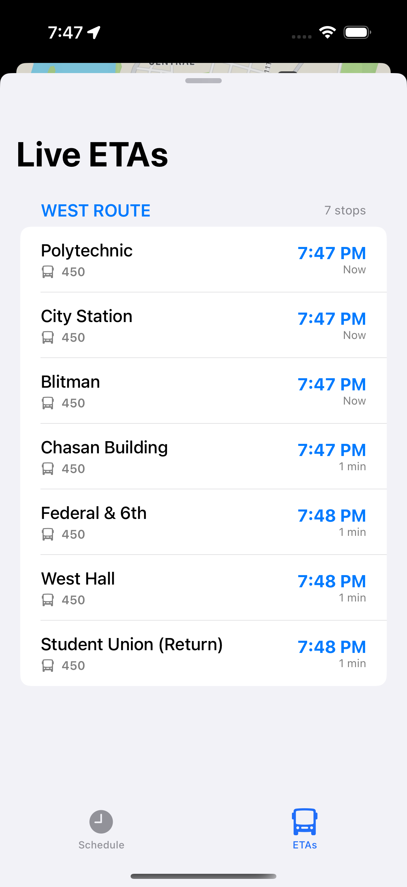
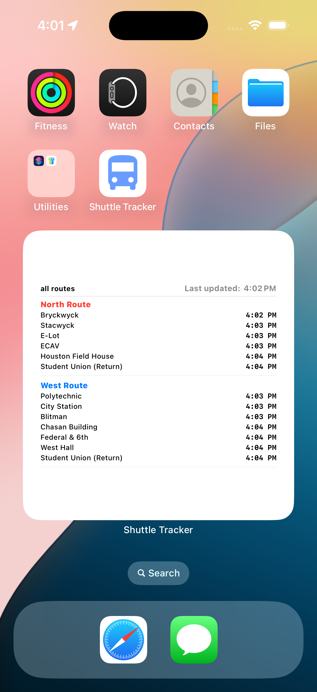
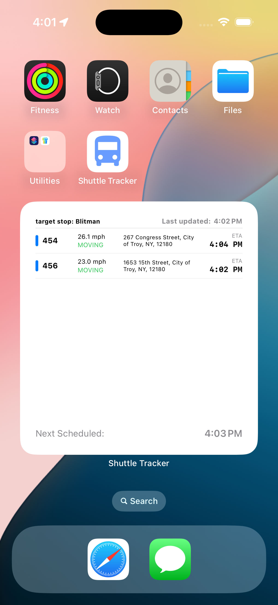

# Shuttle Tracker SwiftUI

A SwiftUI application for tracking shuttle bus locations and schedules in real-time.

### Features
*   **Real-time Map:** View live locations of all shuttles.
*   **Route Information:** See the routes for each shuttle.
*   **Schedules:** Check the schedule for each stop.
*   **ETAs:** Get estimated arrival times for shuttles at your stop.
*   **iOS Widget:** See shuttle information at a glance on your home screen.
*   **Developer Mode:** For debugging and development purposes.

  
   
  
  
  

### Architecture
1. Models
    - Separating concerns between data transfer objects and UI components. Particularly relevent for structs that are storing data from the API.

2. Networking
    - Centralized singleton (thread-safe) APIClient using async/await.
    - Generic fetching of data with well-described endpoints via an enum.
    - Retries failed requests automatically.

3. Persistance
    - File-system caching via the CacheManager.
    - Saves large JSON datasets to disk, particularly the scheduling and static-services that don't require frequent updates.
    - Caching larger datasets will allow for faster loading.

4. Services
    - Dedicated services are injected via the DependencyContainer.
        - VehicleService: Handles high-frequency polling (5s) for live bus data.
        - RouteService: Handles one-time fetch for static route geometry.
        - ScheduleService: Handles timetable data fetching.

5. View/Viewmodel setup for UI
    - Using MVVM to support easy communication between the data and UI refreshes.
        - ViewModels hold state and business logic (ex. merging live ETA with static schedule).
        - Views are renderers that observe ViewModels.
        - Services inject data into ViewModels; ViewModels modify/prepare data; Views redraw automatically.
